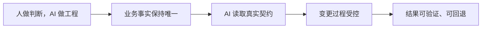

# Nexa 文档

Nexa 是面向业务后端的 AI-first Go 框架。它让 AI 从业务仓中的真实事实出发，使用可执行契约完成代码生成、
标准源码采用和验证，同时让业务仓继续拥有业务定义、生成结果、运行配置与发布节奏。

## 为什么是 Nexa

- **AI 不猜能力。** 先通过同版本 Nexa Skill 路由，再从当前源码、CLI inspection、schema 和测试确认行为。
- **业务事实仍由业务拥有。** Ent、Proto、`.api` 和产品配置保留在最接近业务语义的位置。
- **结果可以审核和重建。** Framework 输出普通源码、versioned projection 和明确验证结果，不接管业务运行。

## 五个核心概念

[核心概念总览](concepts/README.md)提供五个概念的逐页入口，负责建立共同语言，不复制命令、schema 或协议字段。

## 选择你的视角

- [业务开发者视角](developer/nexa.md)：Nexa 能解决什么、哪些能力需要显式选择、最终结果归谁所有。
- [框架开发者视角](developer/framework.md)：系统分层、三条公共边界、变化影响和验证责任。
- [稳定边界](developer/stable-surface.md)：如何判断 Go API、CLI、schema、Skill 和 generated surface 能否依赖。
- [技术选择](developer/technology-choices.md)：为什么采用 typed facts、普通源码和静态组合。

## Nexa 能提供什么

- [统一事实注释协议 v1](contracts/source-comment.md)：Ent、Proto、`.api` 与前端 source contract 的唯一补充事实语法、来源和冲突门禁。
- [业务事实契约](contracts/business-facts.md)：typed FactGraph、服务关系与 authoring ownership。
- [Core IAM 契约](contracts/core-iam.md)：中性的账号、租户、成员、角色、菜单与权限边界。
- `core-application` 双进程 Starter：同一 exact source release 中的 Core API/RPC 与 PostgreSQL consumer 入口。
- [受控生成](contracts/controlled-generation.md)：从 typed facts 到 direct replace-tree 普通源码。
- [前端生成契约](contracts/frontend-generation.md)：comment-capable frontend source、FrontendIR 与 delegated renderer request。
- [HTTP Convention v1](contracts/http-convention.md)：以 PDCL 已验证调用链为基线的 JSON HTTP 路径、envelope、分页与字段约定。
- [标准服务 starter](starters/standard-services.md)：可由 consumer 接管和继续修改的标准源码。
- [Runtime packages](contracts/runtime-packages.md)：按 Go import 和 constructor 显式选择的公共运行契约，包括 `runtime/s3` 与可选 AWS SDK v2 adapter。
- [Nexactl Build Plugin](plugins/nexactl-build-plugin.md)：显式组合工程期能力，不是运行时插件系统。
- [Service Source Plugin](plugins/service-source-plugin.md)：选择和交付标准服务源码的工程期入口。

## 开始采用

- [Nexa Skill 路由](adoption/skills.md)：AI 开发和采用的必选入口及版本边界。
- [快速开始](adoption/quick-start.md)：Skill、module pin、能力发现、最小构建和生成顺序。
- [验证矩阵](adoption/verification-matrix.md)：module、CLI、facts、generated、source 和回滚检查。
- [升级与回滚](adoption/upgrade-and-rollback.md)：分层 checkpoint、升级与恢复边界。

## 精确 Reference

- [当前架构](architecture/framework.md)与[测试策略](architecture/testing-strategy.md)
- [生成清单](contracts/generated-manifests.md)与[Source Bundle](contracts/source-bundles.md)
- [CLI 机器协议](contracts/cli-machine-protocol.md)与[Quality Read Model](contracts/quality-read-model.md)

## 事实与可用性

本目录只描述 `github.com/nxnminieye/nexa` 当前公开实现。Nexa Skill 是 AI 的必选路由入口，但不授权命令
或 repository write。命令、flag、schema、exported API 和 capability 的精确事实由当前二进制 inspection、
owner package、schema 和行为测试拥有；Markdown 不维护第二份机器事实。

[文档治理](architecture/documentation-governance.md)定义渐进披露、主题 owner、当前事实和过程材料边界。
